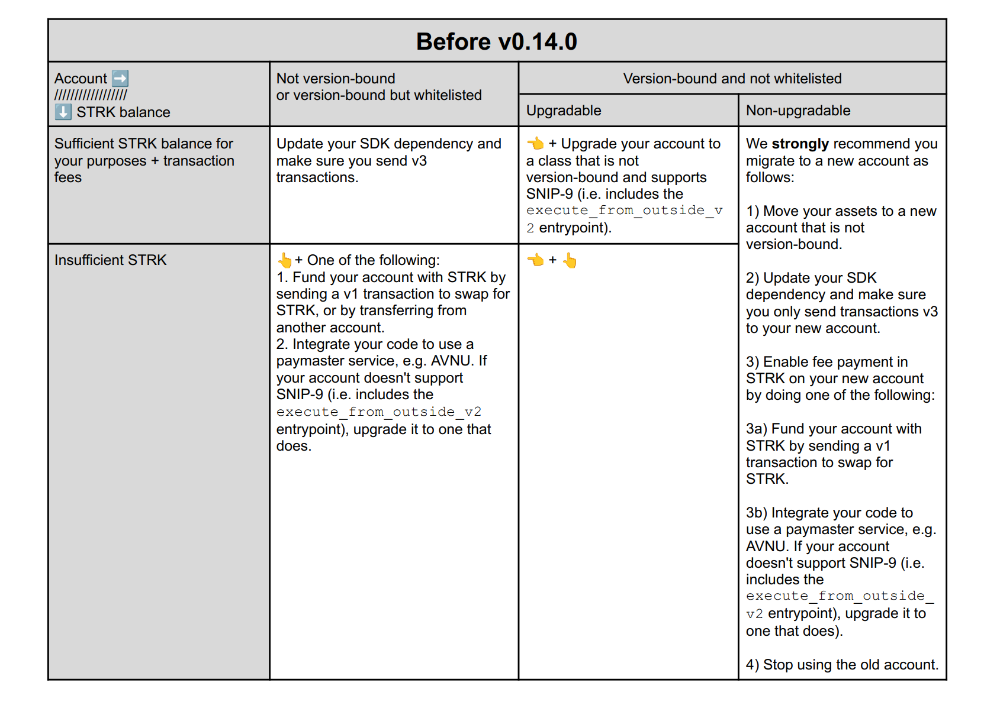
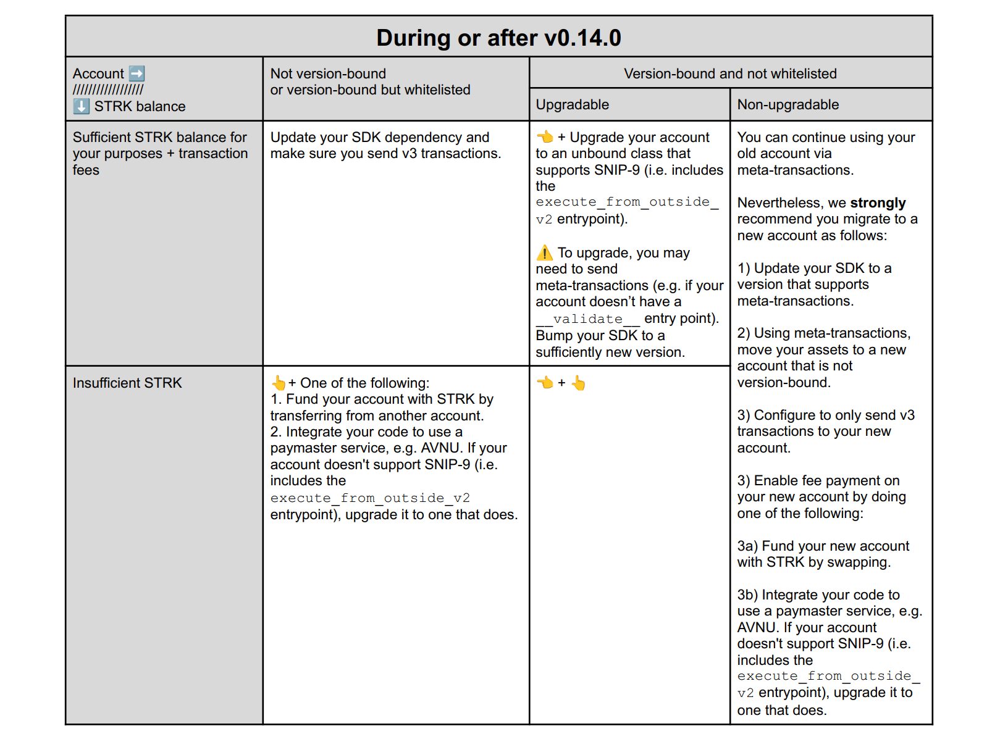

# Breaking changes in Starknet v0.14.0

## Tutorial

**TL;DR.** Starknet v0.14.0 introduces breaking changes that affect old accounts. This short document answers the following questions:

1. What breaks?  
2. What should you do to maintain normal operation?

For additional questions and clarifications, please join our [Discord channel](https://discord.com/channels/793094838509764618/1341687457845870622) on breaking changes.

**💡Note.** This document is a work in progress. It will be expanded with more information during the coming months and will always be linked in announcements pertaining to v0.14.0.

# What breaks in v0.14.0?

In Starknet version 0.14.0 we will terminate support for transaction versions 0,1 and 2, meaning they will be rejected from the sequencer’s mempool (see [SNIP-16](https://github.com/starknet-io/SNIPs/blob/main/SNIPS/snip-16.md#motivation) for motivation).

# What should you do to maintain normal operation?

## Wallet users

We have worked behind the scenes with Starknet wallet teams to simplify your UX.

If you’re a wallet user, you should always use the latest app/extension version. Following the v0.14.0 upgrade, you may find that your wallet prompts instructions. Simply follow them to maintain normal function of your account.

Users may be prompted to:

1. Upgrade their account if it is currently bound to old transaction versions;  
2. Use an applicative paymaster service if they wish to pay transaction fees in ETH;  
3. Purchase a few STRK if they wish to pay transaction fees in STRK but don’t have any.

## Developers

### Background

Conceptually, termination of old transaction versions has three areas of impact:

1. SDK dependency: any flow that sends transaction versions \< 3 will fail.  
2. Version-bound accounts  
   1. v0-bound accounts: CairoZero accounts that do not have a `__validate__` entrypoint are consequently compatible only with v0 transactions.  
   2. v1-bound accounts: Accounts (either in CairoZero or Cairo) whose logic supports only v1 transactions.  
   3. 💡Starknet v0.14.0 will include a feature that allows a whitelist of v1-bound accounts to function with v3 transactions. The whitelist appears below.  
3. Transaction fee payment  
   1. Transactions v3 support native fee payment only in STRK, making native fee payment in ETH no longer possible.  
   2. Fee payment in other tokens will still be possible via applicative paymasters.

### Instructions

The following tables outline what you need to do to maintain/recover normal functionality.
If you’re here before v0.14.0, we strongly recommend you adapt sooner rather than later.

If you adapted before v0.14.0 by following the instructions above, no further action is required\! In particular, the table below is not relevant to you.

The whitelist of v1-bound accounts mentioned above appears in the next section.

#### Whitelist of v1-bound classes

As shown in the instruction table, if your account is whitelisted then you need only make sure you send v3 transactions, and are able to pay the associated transaction fees (in STRK or via applicative paymaster). Nevertheless, we strongly recommend upgrading your account to avoid relying on the whitelist indefinitely.

1. `0x01a736d6ed154502257f02b1ccdf4d9d1089f80811cd6acad48e6b6a9d1f2003`
2. `0x033434ad846cdd5f23eb73ff09fe6fddd568284a0fb7d1be20ee482f044dabe2`  
3. `0x01a7820094feaf82d53f53f214b81292d717e7bb9a92bb2488092cd306f3993f`  
4. `0x0737ee2f87ce571a58c6c8da558ec18a07ceb64a6172d5ec46171fbc80077a48`  
5. `0x05400e90f7e0ae78bd02c77cd75527280470e2fe19c54970dd79dc37a9d3645c`  
6. `0x04c6d6cf894f8bc96bb9c525e6853e5483177841f7388f74a46cfda6f028c755`  
7. `0x0309c042d3729173c7f2f91a34f04d8c509c1b292d334679ef1aabf8da0899cc`  
8. `0x01c0bb51e2ce73dc007601a1e7725453627254016c28f118251a71bbb0507fcb`  
9. `0x0251830adc3d8b4d818c2c309d71f1958308e8c745212480c26e01120c69ee49`  
10. `0x0251cac7b2f45d255b83b7a06dcdef70c8a8752f00ea776517c1c2243c7a06e5`  
11. `0x06d706cfbac9b8262d601c38251c5fbe0497c3a96cc91a92b08d91b61d9e70c4`
